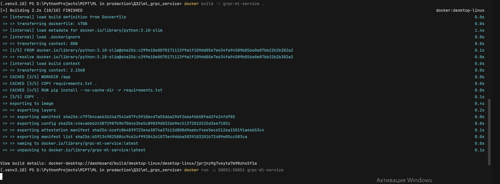
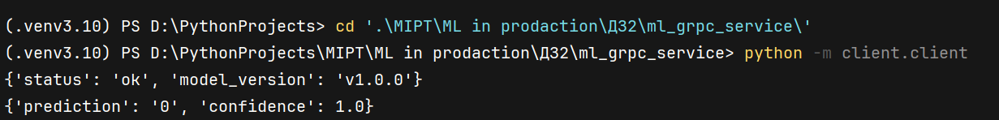

# MLOps HW2 — ml_grpc_service_MAzurinaEA
Вторая домашняя работа по ML в продакшн

##📌 Краткое описание проекта
Проект реализует gRPC‑сервис для предсказаний на основе обученной ML‑модели (Wine dataset). Сервис предоставляет два метода:

  * Health — проверка состояния сервера и версии модели.
  * Predict — получение предсказания класса вина по 13 признакам.

## 📂 Структура проекта

 ├── DZ1.ipynb # ноутбук с последовательным выполнением домашнего задания
 
 ├── data/ # Сырые и обработанные данные (только через DVC)
 
 ├── src/ # Скрипты (prepare.py, train.py)
 
 ├── dvc.yaml # Описание пайплайна
 
 ├── params.yaml # Гиперпараметры
 
 ├── requirements.txt # Зависимости
 
 └── README.md # Документация

 ## 🎯 Цель проекта
Задание выполняется в рамках модуля 2 «Архитектурные паттерны для обслуживания ML-моделей». 
Задание направлено на освоение полного цикла развертывания минимального ML-сервиса — от реализации gRPC-интерфейса до контейнеризации и запуска в изолированном окружении Docker.

  * освоить базовые принципы разработки и тестирования gRPC-сервисов;
  * научиться описывать контракты API в Protocol Buffers и генерировать Python-код;
  * уметь упаковывать ML-модель в контейнер, настраивать переменные окружения;
  * провериь работоспособность сервисов внутри Docker-контейнера.

## 🚀 Как запустить (3–6 команд).
Для запуска проекто необходимо сделать следующие действия командами:

  - клонировать репозиторий: git clone https://github.com/ElizavetaMaz/ml_grpc_service_MAzurinaEA
  - перейти в репозиторий: cd mlops_ml_grpc_service_MAzurinaEA
  - устоновить зависимости: pip install -r requirements.txt
  - собрать Docker‑образ: docker build -t grpc-ml-service .
  - Запустить контейнер: docker run -p 50051:50051 grpc-ml-service

Для проверки состояния сервиса надо:

  - Открыть новый терминал
  - перейти в репозиторий mlops_ml_grpc_service_MAzurinaEA
  - Запустить клиента, который обращается к обоим эндпоинтам: python -m client.client

## 🌐 Пример работы.
В итоге проделанной работы увидите:

